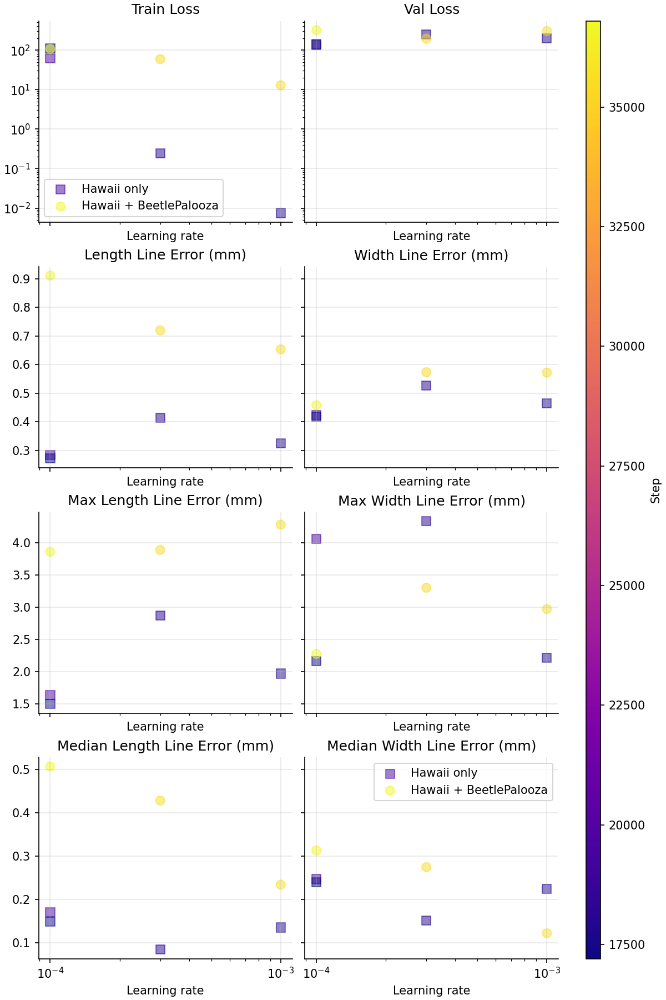

# 001 - Extra data (BeetlePalooza) vs Hawaii-only

Goal: measure whether adding BeetlePalooza training data improves validation on the Hawaii val split, with a focus on elytra length.

Hypothesis: length-only extra data helps reduce Hawaii validation error for elytra length without hurting overall validation loss.

Model: frozen DINOv3 checkpoint with the MLP head. This is the default in `train.Config` and `train.py` already freezes the ViT and trains only the head.

Data and evaluation notes:
- Validation is always on Hawaii val (`train.py` builds the val loader from `hawaii` only).
- Hawaii points are ordered as [width, length]. Length is line index 1.
- BeetlePalooza width is masked in the dataset (`loss_mask = [0.0, 1.0]`), so extra data is length-only by default.
- `hawaii.include_polylines` must be False for now (`hawaii.py` raises NotImplementedError otherwise).
- Current wandb metrics aggregate width and length together. For length-only comparisons, we should compute per-line metrics in a notebook later (see `notebooks/`).

Sweep file:
- `sweep.py`: six runs (three learning rates x two data configurations).

How to run:
- Update the paths at the top of `sweep.py` (Hawaii/BeetlePalooza roots, annotations, DINOv3 checkpoint).
- Use `--sweep` with `launch.py`.
- Add `--slurm-acct` and `--slurm-partition` if you want submitit to use Slurm.
- If you need shorter runs, add `--n-steps`, `--val-every`, and `--save-every` overrides.

Example:

```sh
uv run launch.py \
  --sweep docs/experiments/001-extra-data/sweep.py \
  model:frozen
```

## Results

Final validation loss and line errors vs learning rate (color = step, shape = BeetlePalooza inclusion):



These plots come directly from `notebook.py` in this folder.
We load W&B runs tagged `exp-001`, then plot loss and width/length-specific metrics against learning rate and step.
The y-axis is log-scale for all three to make multiplicative differences easier to see, the point color encodes the training step (to show how far each run progressed), and marker shape indicates whether BeetlePalooza data was included.
This view is intended to answer whether adding BeetlePalooza shifts the validation curves on Hawaii across learning rates while controlling for partial runs or early failures.

In conclusion, it seems like BeetlePalooza data doesn't help.
Possible explanations:

- Since we are only evaluating on Hawaii, introducing any data besides Hawaii is a distribution shift.
- The BeetlePalooza data is simply too noisy.
- The model doesn't have enough capacity to take advantage of the extra data.
- The learning rate is not optimal. Both configs seem like they'd benefit from a higher learning rate.
