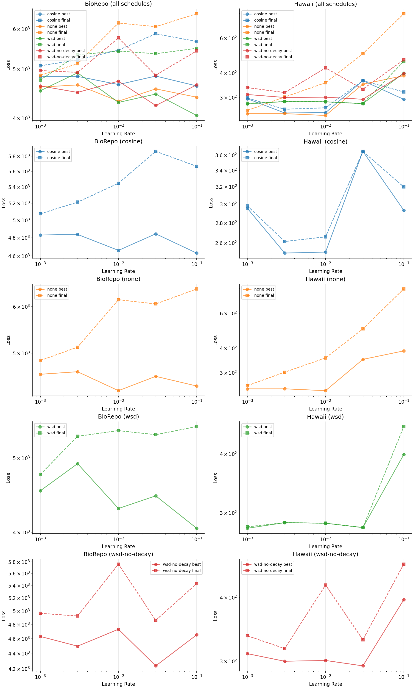

# 003 - Learning Rate Scheduling

Goal: find the best combination of learning rate and LR schedule for the frozen DINOv3 + MLP head setup.

Hypothesis: a schedule with warmup and decay (cosine or WSD) will outperform a fixed learning rate, especially at higher LRs where fixed rates are prone to instability.

Model: frozen DINOv3 ViT-S/16 backbone with a trainable MLP head (same as experiments 001 and 002). All runs use augmentation and 4 dataloader workers.

## Design

Four schedules were tested, all trained for 74k steps:

| Schedule | Warmup | Stable | Decay | Description |
|---|---|---|---|---|
| `cosine` | 3,700 | -- | 70,300 (cosine) | Warmup then cosine anneal to 0 |
| `wsd` | 3,700 | 62,900 | 7,400 (linear) | Warmup-Stable-Decay |
| `wsd-no-decay` | 3,700 | 70,300 | 0 | Warmup-Stable (no decay phase) |
| `none` | 0 | 74,000 | 0 | Fixed learning rate |

Each schedule was crossed with five learning rates: 1e-3, 3e-3, 1e-2, 3e-2, 1e-1 (20 runs total, seed 17).

Sweep file:
- `sweep.py`: 20 runs (5 learning rates x 4 schedule configs).

How to run:

```sh
uv run launch.py \
  --sweep docs/experiments/003-lr-scheduling/sweep.py
```

## Results

Best and final validation loss vs learning rate for BioRepo (left) and Hawaii (right), broken out by schedule:



These plots come from `notebook.py` in this folder. We load W&B runs tagged `exp-003-lr-scheduling`, compute each run's best (min) and final validation loss, and plot them against learning rate on log-log axes. 

observations:

- Best learning rate is between 1e-2, 3e-2, learning rates show a parabola shape meaning that 1e^-1 is too unstable
- WSD and Cosine both show good results, however it seems hard to understand patterns from Biorepo. The distance between best loss and final loss is much greater for biorepo as opposed hawaii between training schedules.