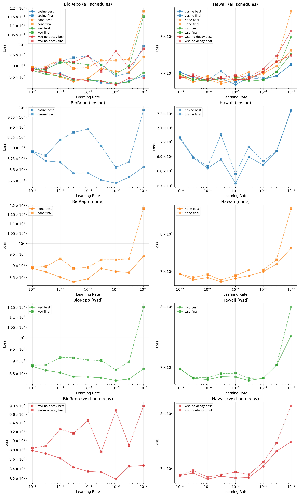

# 005 - Learning Rate Scheduling with Heatmap Objective

Goal: repeat the LR scheduling sweep from experiment 003, but using the heatmap objective and model instead of the frozen DINOv3 + MLP head.

Hypothesis: the heatmap model requires a different LR range than the MLP head, and schedule choice will still matter.

Model: DINOv3 ViT-S/16 with a heatmap head trained with heatmap size 64 and sigma 1.0. Datasets: Hawaii, Beetlepalooza, and BioRepo. Augmentation is applied (normalize only, no crop).

## Design

Four schedules were tested, all trained for 80k steps:

| Schedule | Warmup | Stable | Decay | Description |
|---|---|---|---|---|
| `cosine` | 4,000 | -- | 76,000 (cosine) | Warmup then cosine anneal to 0 |
| `wsd` | 4,000 | 68,000 | 8,000 (linear) | Warmup-Stable-Decay |
| `wsd-no-decay` | 4,000 | 76,000 | 0 | Warmup-Stable (no decay phase) |
| `none` | 0 | 80,000 | 0 | Fixed learning rate |

Each schedule was crossed with nine learning rates: 1e-5, 3e-5, 1e-4, 3e-4, 1e-3, 3e-3, 1e-2, 3e-1, 1e-1, (36 runs total, seed 17). The LR range is much lower than experiment 003 because the heatmap model is sensitive to larger updates.

Sweep file: `sweep.py` (16 runs: 4 learning rates x 4 schedule configs).

How to run:

```sh
uv run launch.py \
  --sweep docs/experiments/005-lr-scheduling-with-heatmap/sweep.py
```

## Results

Best and final validation loss vs learning rate for BioRepo (left) and Hawaii (right), broken out by schedule:



These plots come from `notebook.py` in this folder. We load W&B runs tagged `exp-005-lr-scheduling-with-heatmap`, compute each run's best (min) and final validation loss, and plot them against learning rate on log-log axes.

Observations:

- The optimal learning rate is much lower than in experiment 003 (around 1e-5 to 3e-5), reflecting the different model architecture.
- Cosine degrades sharply at 3e-4 on BioRepo, suggesting it is sensitive to high LRs with this objective.
- WSD and WSD-no-decay are more stable across LRs, with WSD-no-decay performing competitively at low learning rates.
- To explain the difference between best and final loss on BioRepo, a likely cause is overfitting as the best loss is achieved at early training steps and the loss either increases or is stable. Additionally, the best loss occurs on the noisy spikes downward. This is supported by the fact that the loss curves of val/hawaii follow a steady descent.
